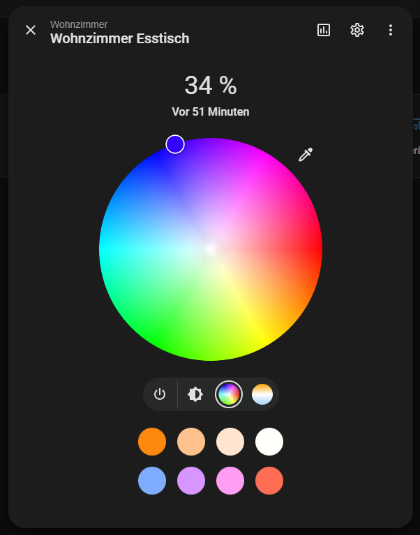
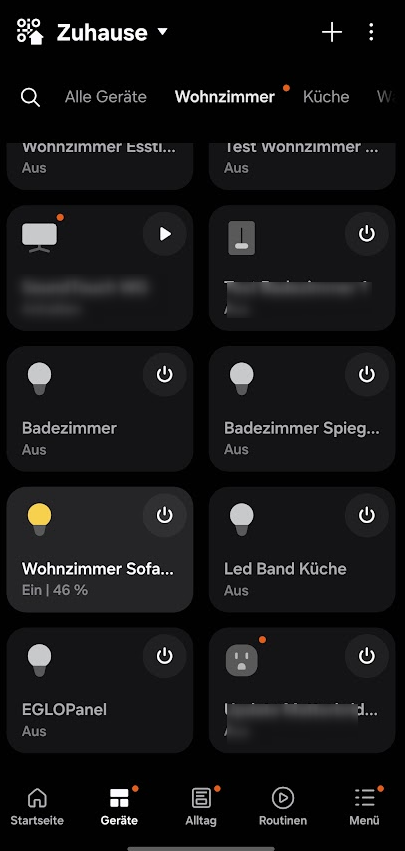
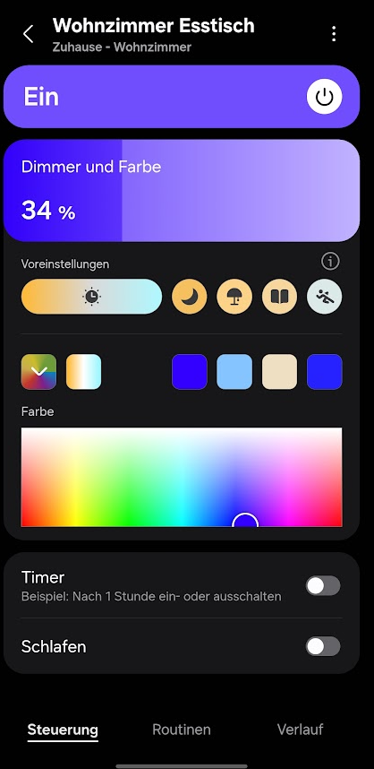

<div align="center">

# awoxble2mqtt-api

**Local-first control for AwoX / EGLO smart lamps — BLE mesh, no cloud, no phone app required.**

A .NET 10 service that drives AwoX "Connect-C" and "Connect-Z" bulbs directly over their
Bluetooth mesh, reads their live state passively, and bridges everything to Home Assistant
(and from there to SmartThings / Apple Home / Google / Alexa over Matter).

Runs on a Raspberry Pi (BlueZ) and on Windows (WinRT) from the same codebase.

[Install](docs/INSTALL.md) · [Configuration](docs/CONFIGURATION.md) · [Smart Home (MQTT→Matter)](docs/SMARTHOME.md) · [Pi deployment](DEPLOY-PI.md) · [Roadmap](docs/ROADMAP.md)

</div>

---

## In the wild

The same AwoX lamps — controlled locally with live state, dimming and colour — from **Home Assistant**
and from the **Samsung SmartThings** app (reached via the MQTT → Matter bridge).

| Home Assistant | SmartThings — devices | SmartThings — control |
|:---:|:---:|:---:|
|  |  |  |

## Features

- **🔌 Direct BLE mesh control** — connects to one reachable bulb (the gateway), logs in with
  your mesh name/password, and addresses every lamp by its mesh id. No AwoX cloud, no phone app
  in the loop. Power, RGB colour, white colour-temperature and brightness.
- **📡 Live status from passive advertisements** — AwoX bulbs broadcast their full state
  (on/off, brightness, colour, white-temp) unencrypted in their BLE advertisements. We read it
  with a *passive scan* — no connection, no login, and it never steals the link from the app/hub.
- **🛰️ Relay-verify** — a command to an out-of-range lamp is relayed through a reachable mesh
  sibling, then **confirmed against the target's own advertisement** (a change we can't observe
  landing is a change we don't claim). Reachable (host→target) routes are learned and reused;
  an unconfirmed relay falls back to a direct connect.
- **🎬 Scenes** — named sets of lamps + desired states, applied in one call. Lamps are driven
  **grouped by mesh** (one connect per mesh, the rest relayed) so a mixed-mesh scene doesn't
  thrash the radio.
- **🔀 Multi-mesh connections** — holds one GATT session **per mesh** (up to `ble.max_connections`)
  so commands for lamps on different meshes run **concurrently** instead of reconnecting on every
  mesh switch; within a mesh a single session still fans out via relay/broadcast.
- **⚡ Live push (SignalR)** — every state change is pushed to clients over `/hubs/lights`,
  keyed by MAC.
- **🏠 Home Assistant / Matter bridge** — a standalone [MQTT bridge](src/AwoxController.MqttBridge)
  publishes all lamps + scenes in HA's MQTT-discovery format (rooms via `suggested_area`). HA then
  re-exports them to **SmartThings, Apple Home, Google Home and Alexa** via a Matter bridge add-on.
- **🪟🐧 Cross-platform** — the AwoX login/crypto is shared; the GATT transport is BlueZ on
  Linux and WinRT on Windows, picked automatically by target framework.
- **🎚️ Runtime-tunable** — poll cadence, relay timeouts, connect-settle, idle-disconnect etc.
  live in a DB-backed `app_settings` table and change at runtime via `/api/settings` — no restart.
- **☁️ Cloud import (optional)** — one-time import of mesh credentials + device list from your
  AwoX app account, so you don't transcribe MACs by hand.

> **Frontend:** a web UI (ASP.NET Core BFF + Angular) exists and will be published separately
> once a few rough edges are fixed. This repository is the backend + the smart-home bridge.

## Architecture

```
                 ┌──────────────── AwoxController.Api (:5080) ────────────────┐
 AwoX lamps ──BLE┤  BlueZ (Linux) / WinRT (Windows)  ·  passive advert scan   │
 (Connect-C/-Z)  │  REST control + scenes + /api/settings  ·  SignalR hub      │
                 │  device registry (MariaDB/MySQL or SQLite)                  │
                 └───────────────┬───────────────────────────┬────────────────┘
                                 │ REST + SignalR             │ (optional)
                  AwoxController.MqttBridge            AwoxController.Zigbee
                   → MQTT (HA discovery)                → Zigbee2MQTT (real Zigbee)
                                 │
                     MQTT broker (Mosquitto) → Home Assistant → Matter → SmartThings/Apple/Google/Alexa
```

### Projects

| Project | Role |
|---------|------|
| `AwoxController.Core` | Domain models + `ILightService` (transport-agnostic, no deps) |
| `AwoxController.Ble` | AwoX BLE mesh: login/crypto, BlueZ + WinRT transports, advert scan, relay-verify |
| `AwoxController.Zigbee` | Optional Zigbee2MQTT client for *real* Zigbee devices |
| `AwoxController.Data` | EF Core device/scene/settings registry (MySQL / SQLite) |
| `AwoxController.Api` | ASP.NET Core host — REST, SignalR, scenes, settings |
| `AwoxController.MqttBridge` | Standalone worker: publishes the API to HA via MQTT discovery |

## Quick start

```bash
# 1. Database (MariaDB/MySQL) — creates the DB, user and all tables (see docs/INSTALL.md)
./database/CreateDBEnv.ps1 -Password <rootPassword>          # add -MySqlHost <pi> for a remote DB

# 2. Secrets + config — copy the template and fill in mesh creds + DB connection string
cp src/AwoxController.Api/appsettings.Development.example.json \
   src/AwoxController.Api/appsettings.Development.json
#   edit it: AwoxBle.MeshName/MeshPassword/Devices + ConnectionStrings:AwoxDb

# 3. Run
dotnet run --project src/AwoxController.Api -f net10.0                 # Linux / Pi (BlueZ)
dotnet run --project src/AwoxController.Api -f net10.0-windows10.0.19041.0   # Windows (WinRT)
```

API on `http://localhost:5080` (Swagger at `/swagger`). Full install, deployment and the smart-home
bridge: **[docs/INSTALL.md](docs/INSTALL.md)**. Every setting explained: **[docs/CONFIGURATION.md](docs/CONFIGURATION.md)**.

## Key endpoints

| Method | Route | Body |
|--------|-------|------|
| GET | `/api/devices` | — (registry + live state) |
| POST | `/api/devices/{key}/on` · `/off` | `?via=<gw>` to relay |
| PUT | `/api/devices/{key}/color` | `{ "r":0-255, "g":.., "b":.. }` |
| PUT | `/api/devices/{key}/brightness` · `/colorBrightness` | `{ "percent":0-100 }` |
| PUT | `/api/devices/{key}/colorTemp` | `{ "mireds":153-500 }` |
| GET/POST | `/api/scenes` · `/api/scenes/{id}/apply` | scene CRUD + apply |
| GET/PUT | `/api/settings` | runtime-tunable `app_settings` |
| GET | `/api/ble/scan?seconds=8` · `/api/ble/probe/{mac}` | find AwoX bulbs |
| WS | `/hubs/lights` | SignalR `StateChanged` (keyed by MAC) |

`{key}` is a device id, friendly name, or MAC.

## Acknowledgements

This project stands on prior reverse-engineering work — thank you:

- **[Leiaz/python-awox-mesh-light](https://github.com/Leiaz/python-awox-mesh-light)** (GPLv3) — the AwoX /
  Telink BLE mesh protocol and crypto. The **algorithm** (AES-128-ECB over byte-reversed key/value, the
  command opcodes, the status frame layout) was re-implemented independently in C#; no source was copied.
- **[fsaris/home-assistant-awox](https://github.com/fsaris/home-assistant-awox)** — the AwoX/EGLO Parse
  cloud endpoints + app keys used by the optional `/api/devices/import/cloud` lamp import.

Protocols and algorithms aren't themselves copyrightable, so this Apache-2.0 codebase re-implements them
rather than redistributing the GPL sources — but the credit is theirs.

## License

[Apache-2.0](LICENSE) © 2026 Sebastian Sauer.
